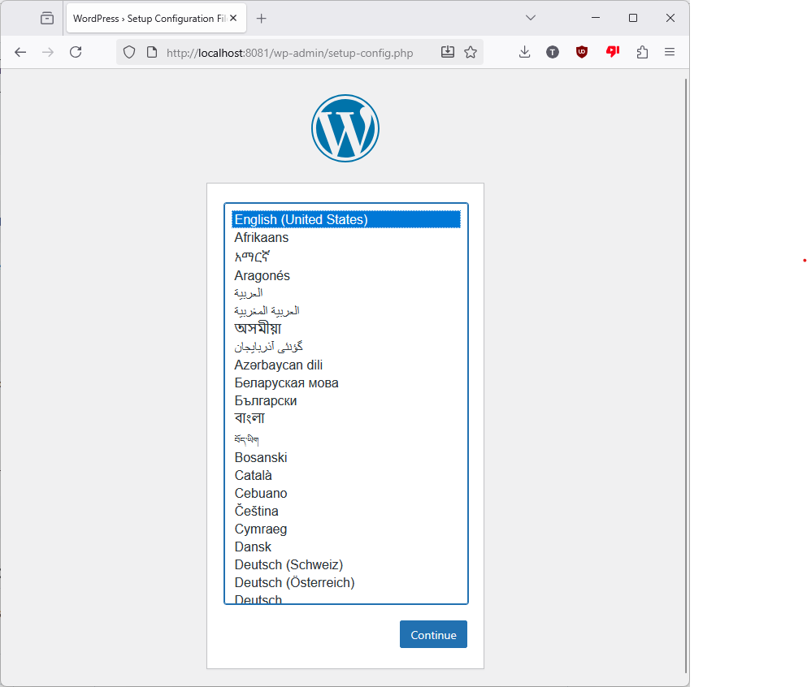
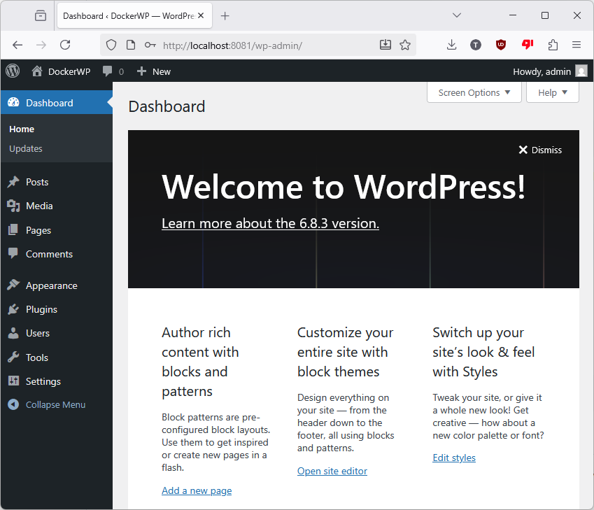
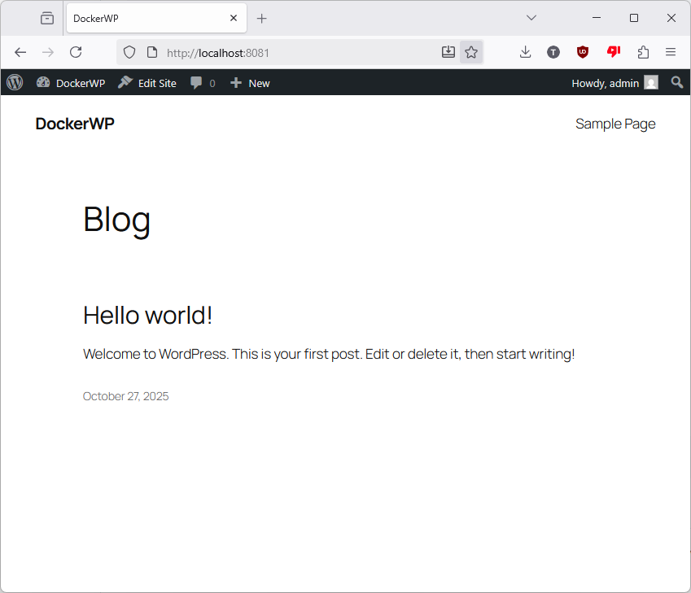
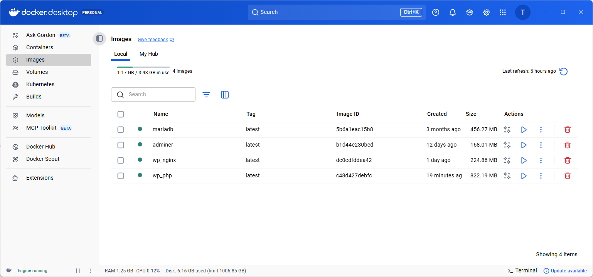
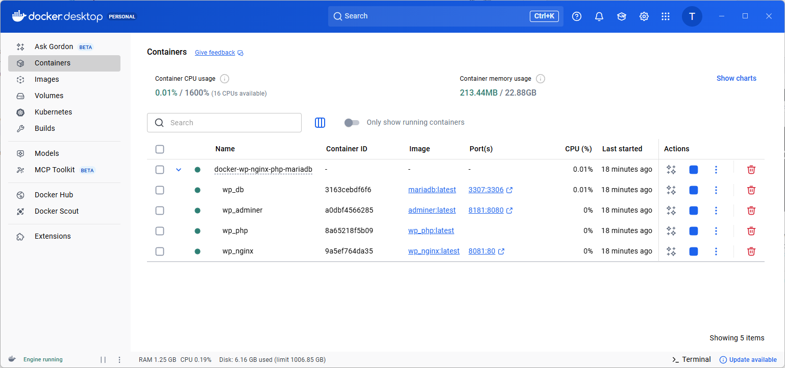
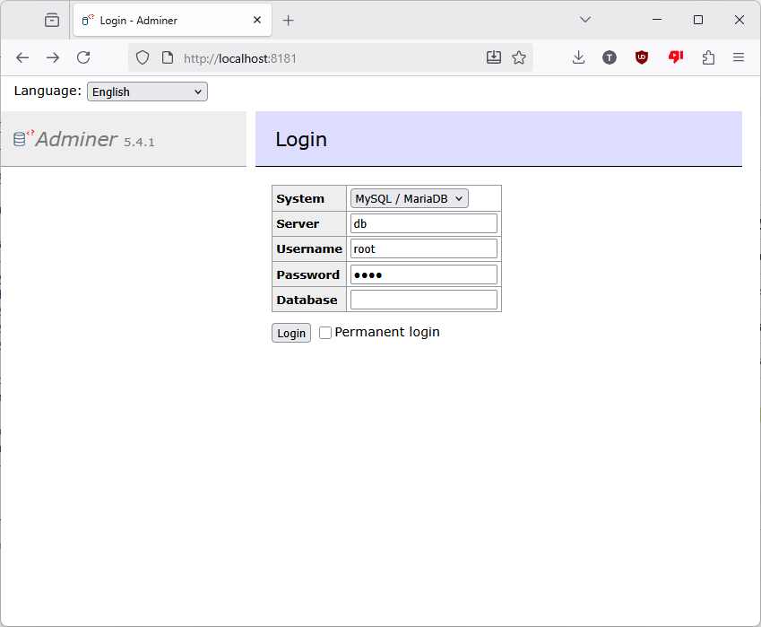
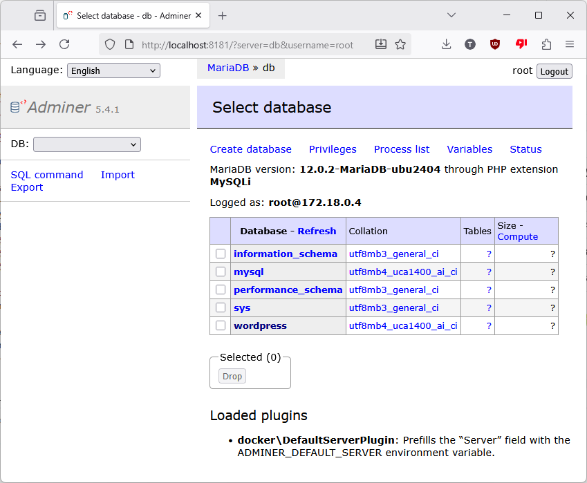

# 🐳 Docker WordPress + Nginx

A lightweight Docker-based setup for running **WordPress** with **Nginx** and **PHP-FPM**.  
Ideal for **local development**, **testing**, or **quick deployment** scenarios.

## 🚀 Features

- WordPress served via **Nginx** and **PHP-FPM**
- **MariaDB** container included (drop-in MySQL replacement)
- **Adminer** lightweight web-based database browser
- Managed through **Docker Compose** for easy orchestration
- Clean, modular structure for extending or customizing services
- **Pinned image versions** for reproducible, stable builds
- **Health checks** on all services for automatic failure detection
- **Auto-restart** policies (`unless-stopped`) for all containers
- **Gzip compression** and **security headers** via Nginx
- **OPcache** fully configured for PHP performance
- **Hardened security**: database port bound to localhost only

## 🧰 Tech Stack

- Docker & Docker Compose
- Nginx
- PHP-FPM
- WordPress
- MariaDB
- Adminer (for DB management)

## 📦 Folder Structure

```text
docker-wordpress-nginx/
├── .env                   # Environment variables (copy from .env.example)
├── .env.example           # Template with documented environment variables
├── docker-compose.yml     # Defines services for WordPress, MariaDB, Nginx, PHP-FPM, and Adminer
├── .github/               # GitHub Actions CI/CD configuration
│    └── workflows/
│        └──docker-ci.yml  # GitHub workflow for building/testing Docker images
├── nginx/                 # Nginx service
│   ├── .dockerignore      # Files excluded from the Nginx Docker build context
│   ├── default.conf       # Nginx configuration for serving WordPress
│   └── Dockerfile         # Custom Nginx image
├── php/                   # PHP-FPM service
│   ├── .dockerignore      # Files excluded from the PHP Docker build context
│   ├── Dockerfile         # Custom PHP image with OPcache and extensions
│   └── wordpress/         # WordPress source files
│       └── readme.txt
└── mariadb/               # (optional) MariaDB initialization scripts
    └── init.sql
```

## 🛠️ Getting Started
 1. Clone the repository
```text
git clone https://github.com/micro-pi/docker-wordpress-nginx.git
cd docker-wordpress-nginx
```

2. Configure your environment
Copy `.env.example` to `.env` and set your credentials:
```text
cp .env.example .env
```
Then edit `.env` with your values:
```text
# NGINX Configuration
NGINX_PORT=8081

# MariaDB settings
MYSQL_ROOT_PASSWORD=your_root_password
MYSQL_DATABASE=wordpress_db
MYSQL_USER=wordpress_user
MYSQL_PASSWORD=your_db_password

# Database port (bound to localhost only)
DB_PORT=3307

# Adminer port
ADMINER_PORT=8181
```
> ⚠️ **Security:** Never commit your `.env` file. Use strong passwords in non-local environments.

3. Build and Start the Docker containers
```text
docker compose up -d
```
This builds and launches **WordPress**, **Nginx**, **PHP-FPM**, **MariaDB**, and **Adminer** containers in detached mode.

To check running containers:
```text
docker compose ps
```
**🚀 Running Containers**
```text
NAME         IMAGE              COMMAND                  SERVICE   CREATED          STATUS                    PORTS
wp_adminer   adminer:4.8.1      "entrypoint.sh docke…"   adminer   10 minutes ago   Up 9 minutes (healthy)    0.0.0.0:8181->8080/tcp
wp_db        mariadb:11.0       "docker-entrypoint.s…"   db        10 minutes ago   Up 9 minutes (healthy)    127.0.0.1:3307->3306/tcp
wp_nginx     wp_nginx:latest    "/docker-entrypoint.…"   nginx     9 minutes ago    Up 9 minutes (healthy)    0.0.0.0:8081->80/tcp
wp_php       wp_php:latest      "docker-php-entrypoi…"   php       10 minutes ago   Up 9 minutes (healthy)    9000/tcp
```

4. Access your WordPress site
Open your browser and visit:
- [http://localhost](http://localhost/)
- or [http://127.0.0.1](http://127.0.0.1/)

5. Stop and clean up
To stop the stack and remove all containers and volumes:
```text
docker compose down -v
```

## 🧪 DEV Mode (Live Local Editing)

The setup now uses one shared base file (`docker-compose.yml`) and small suffix overlays:
- `docker-compose.prod.yml` -> suffix `prod`
- `docker-compose.dev.yml` -> suffix `dev`

This keeps one source of truth for services while generating unique project and container names per environment.

1. Start in dev mode:
```text
docker compose -f docker-compose.yml -f docker-compose.dev.yml up -d
```

2. Rebuild only when Dockerfiles or image dependencies change:
```text
docker compose -f docker-compose.yml -f docker-compose.dev.yml up -d --build
```

3. Stop dev mode:
```text
docker compose -f docker-compose.yml -f docker-compose.dev.yml down
```

4. Start prod mode:
```text
docker compose -f docker-compose.yml -f docker-compose.prod.yml up -d
```

5. Confirm resolved names/config:
```text
docker compose -f docker-compose.yml -f docker-compose.dev.yml config
docker compose -f docker-compose.yml -f docker-compose.prod.yml config
```

Example generated container names:
- DEV: `wp_nginx_dev`, `wp_php_dev`, `wp_db_dev`, `wp_adminer_dev`
- PROD: `wp_nginx_prod`, `wp_php_prod`, `wp_db_prod`, `wp_adminer_prod`

> Note: container-name conflicts are solved by suffixes. If you run DEV and PROD at the same time, ensure host ports are different between the two runs.

### 🔹 WordPress

**Setup Configuration**


**Dashboard**


**Home Page**


## 🐳 Docker Status

Below you can see the local Docker environment after building the stack.

### 🧱 Images
```text
PS D:\workspaces\docker-workspace\docker-wordpress-nginx> docker images
REPOSITORY   TAG       IMAGE ID       CREATED         SIZE
wp_php       latest    c48d427debfc   7 minutes ago   822MB
wp_nginx     latest    dc0cdfddea42   30 hours ago    225MB
adminer      4.8.1     b1d44e230bed   11 days ago     168MB
mariadb      11.0      5b6a1eac15b8   2 months ago    456MB
```

#### 📸 Docker Desktop – Images View


### 🚀 Running Containers
```text
PS D:\workspaces\docker-workspace\docker-wordpress-nginx> docker ps
CONTAINER ID   IMAGE              COMMAND                  CREATED         STATUS                   PORTS                                         NAMES
9a5ef764da35   wp_nginx:latest    "/docker-entrypoint.…"   7 minutes ago   Up 7 minutes (healthy)   0.0.0.0:8081->80/tcp                          wp_nginx
a0dbf4566285   adminer:4.8.1      "entrypoint.sh docke…"   7 minutes ago   Up 7 minutes             0.0.0.0:8181->8080/tcp, [::]:8181->8080/tcp   wp_adminer
8a65218f5b09   wp_php:latest      "docker-php-entrypoi…"   7 minutes ago   Up 7 minutes (healthy)   9000/tcp                                      wp_php
3163cebdf6f6   mariadb:11.0       "docker-entrypoint.s…"   7 minutes ago   Up 7 minutes (healthy)   127.0.0.1:3307->3306/tcp                      wp_db
```

#### 📸 Docker Desktop – Running Containers


## 🗄️Database Configuration
The setup includes a **MariaDB 11.0** container with default credentials (customizable via `.env`):
**Default values (for local use):**
| Variable               | Default                    |
| ---------------------- | -------------------------- |
| `MYSQL_DATABASE`       | wordpress_db               |
| `MYSQL_USER`           | wordpress_user             |
| `MYSQL_PASSWORD`       | wordpress_password_change_me |
| `MYSQL_ROOT_PASSWORD`  | root_password_change_me    |

> 🔒 **Security:** The database port is bound to `127.0.0.1` only, preventing external network access. It is accessible on the host for tools like Adminer or DB clients, but not exposed publicly.
## ⚙️ Customization
You can tweak the following `.env` variables to fit your environment:
| Variable          | Description                             | Default     |
| ----------------- | --------------------------------------- | ----------- |
| `NGINX_PORT`      | Public port for WordPress               | `8081`      |
| `ADMINER_PORT`    | Exposed Adminer port                    | `8181`      |
| `DB_PORT`         | MariaDB port (localhost only)           | `3307`      |
| `MYSQL_DATABASE`  | WordPress database name                 | `wordpress_db` |
| `MYSQL_USER`      | WordPress database user                 | `wordpress_user` |
| `MYSQL_PASSWORD`  | WordPress database password             | *(set in .env)* |
| `MYSQL_ROOT_PASSWORD` | MariaDB root password               | *(set in .env)* |

To apply changes after editing `.env`:
```text
docker compose build
docker compose up -d
```

## 🧩 Database Browser (Adminer)
This setup includes Adminer — a lightweight, single-file database management tool for **MariaDB/MySQL**.
It provides a simple web interface to explore, query, and manage your WordPress database.

**🔹 Configuration**
Adminer is defined as a separate service in `docker-compose.yml`:
```text
adminer:
  image: adminer:4.8.1
  container_name: wp_adminer
  depends_on:
    - db
  ports:
    - ${ADMINER_PORT}:8080
  environment:
    ADMINER_DEFAULT_SERVER: db
  restart: unless-stopped
```

**🔹 Environment Variable**
Add to your `.env` file (if not already present):
```text
ADMINER_PORT=8181
```

**🔹 Usage**
1. Start the stack:
```text
docker compose up -d
```

2. Open Adminer:
- [http://localhost:8181](http://localhost:8181/)
- or [http://127.0.0.1:8181](http://127.0.0.1:8181/)

(or `http://localhost:${ADMINER_PORT}` if changed)

3. Log in using your database credentials:

| Field        | Value                                           |
| ------------ | ----------------------------------------------- |
| **System**   | MySQL                                           |
| **Server**   | db                                              |
| **Username** | `${MYSQL_USER}` or `root`                       |
| **Password** | `${MYSQL_PASSWORD}` or `${MYSQL_ROOT_PASSWORD}` |
| **Database** | `${MYSQL_DATABASE}`                             |

### 🖼️ Adminer Screenshots

**Login Page**


**Database Selection**


## 🧩 Troubleshooting
🛑 Port already in use
```text
# Change port in .env (e.g. NGINX_PORT=8082) and restart
docker compose down
docker compose up -d
```

🔑 Permission denied for WordPress files
```text
sudo chown -R www-data:www-data wordpress
```

⚙️ Database connection errors
- Ensure the db container is running:
```text
docker compose ps
```
- Check your .env values (especially WORDPRESS_DB_HOST).

🔍 View logs
```text
docker compose logs -f
```

## 🤖 Continuous Integration
This project includes a **GitHub Actions** workflow:
```text
.github/workflows/docker-ci.yml
```
It automatically:
- Builds all Docker images
- Verifies syntax and configuration
- Prepares images for deployment/testing

## 🤝 Contributing
Pull requests are welcome!
For major changes, please open an issue first to discuss what you’d like to improve.

## 📄 License
This project is open source and available under the **MIT License**.